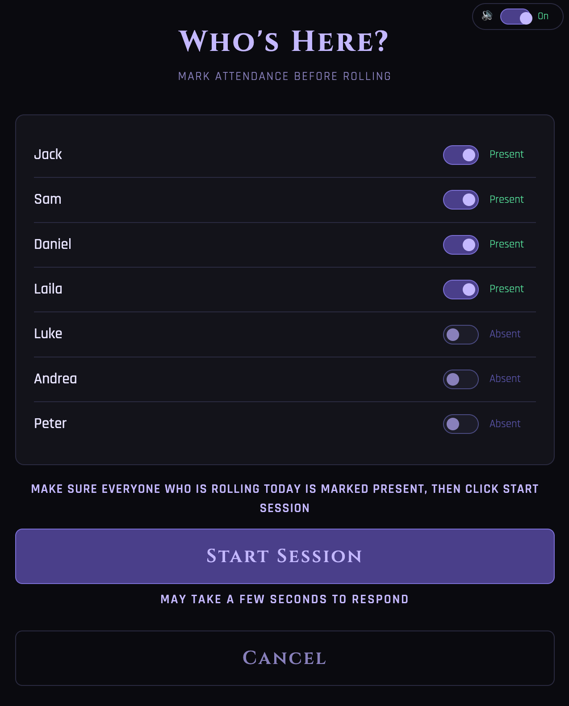
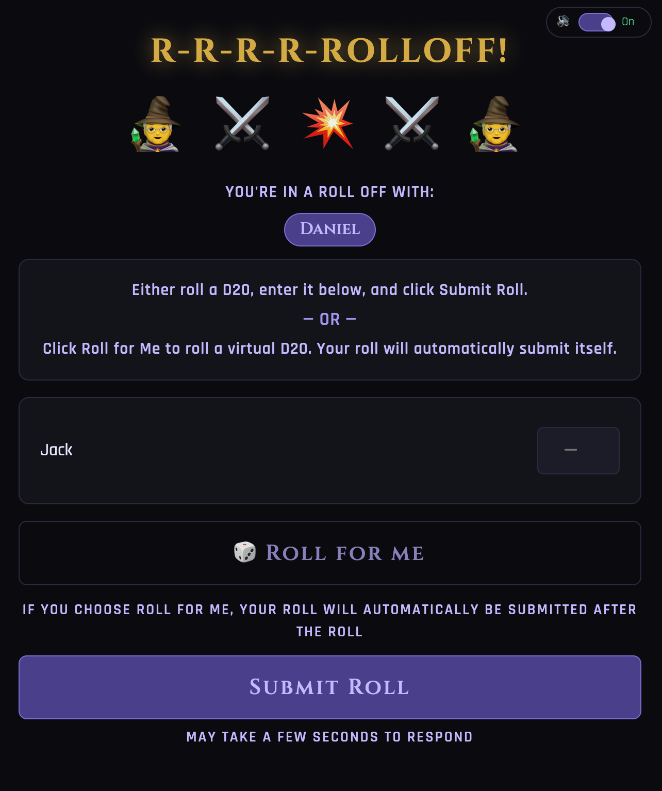

# RollCall

A D20-based standup order roller for agile teams. Stop arguing about who goes first and let the dice decide. Tracks rolling averages, handles tiebreaker rolloffs automatically, and archives quarterly leaderboards. May your nat 20s be plentiful and your 1s few.

Built on Google Apps Script. No server, no hosting fees, no dependencies. One URL for your whole team.

---
---
<details>
<summary><h1>📋 Release Notes — click to expand</h1></summary>

<br>

<details>
<summary><strong>October 7, 2026</strong> — Always-On Penalty, Single-Starter Lock, Session Cancel, Polish</summary>

### Files Updated
`Code.gs` and `Index.html`

To apply: replace both files in the Apps Script editor, save each, then go to **Deploy > Manage deployments > pencil icon > New version > Deploy**. Your URL stays the same. No bootstrapping needed.

---

### Code.gs

**Attendance penalty is now always active**
The -3 attendance penalty previously stayed dormant until the top roller hit 15 rolls. That gate is gone — the penalty now applies from the very first sessions of a quarter. The threshold still scales with the leader (anyone below 33% of the top roller's session count is penalized), so early in the quarter when counts are tiny the rounded threshold naturally keeps nobody penalized until there is a meaningful gap. As each sync happens, the people showing up most get the most accurate standings. This was changed in both the live leaderboard and the retroactive recalculation so they stay consistent.

**Single-starter session lock**
Only one person can start a session at a time now. The moment someone clicks Start Session and enters the attendance screen, a short-lived "starting" claim is set in `SessionState`. The claim carries the starter's client id and a timestamp, auto-expires after 2 minutes (so a leader who closes their tab mid-attendance doesn't lock everyone out), and is cleared automatically when the session actually starts or is cancelled. The poll endpoints now return the current claim holder so other clients can react.

**Past quarters sorted newest-first**
`getPastLeaderboards` now returns quarters with the most recent first, so the current/latest quarter is always at the top of both the in-app Past Quarters screen and the standalone history page.

---

### Index.html

**"Roll for Initiative" header + renamed button**
The home screen now shows a "⚔ Roll for Initiative" header with the button beneath it renamed to **Start Session (Leader Only)**, to make it obvious that only the meeting leader needs to click it.

**Single-starter lock with instant feedback**
When a leader starts a session, everyone else's Start Session button greys out to "Session starting… please wait" so they can't click in and get stuck. A trigger-happy person who clicks at the same moment gets their button greyed out instantly the moment the backend rejects their claim — they stay on the home screen and get pulled into the roll automatically once the leader finishes attendance. Google Apps Script can't push to clients, so this is the fastest feedback possible without a persistent connection.

**Adaptive home polling**
The home screen used to poll on a fixed interval. It now polls every 3 seconds normally, automatically speeding up to every 1 second the instant it detects a session is being started, then dropping back to 3 seconds once things settle. This makes the lock and the auto-redirect feel nearly instant without polling fast all day and burning through executions.

**Cancel Session button on the active-session screens**
A small red "✕ Cancel Session" button now sits in the top-left corner of the Who Are You, Is This You, roll entry, and waiting/rolloff screens. It prompts for confirmation, then boots everyone from the session, saves none of that session's data, releases the starting lock, and returns everyone to a clean home screen where a new session can begin. It only ever clears the live session — previous sessions and all historical data are never touched. Everyone else is routed home automatically when the session is cancelled out from under them.

**Contrast fixes**
The achievement goal line ("Most nat 20s", etc.) and the "No contenders" label were too dim; both are now brighter. The roll count next to each name and the "Archived" date on the past-quarter views were also bumped up for readability.

</details>

---

<details>
<summary><strong>October 2, 2026</strong> — Attendance Penalty, Quarter Achievements, Retroactive Recalc</summary>

### Files Updated
`Code.gs`, `Index.html`, and `History.html`

### How to Apply

1. Open your Google Sheet and go to **Extensions > Apps Script**
2. Replace `Code.gs`, `Index.html`, and `History.html` — select all, delete, paste the new contents, save each one
3. **Run `bootstrapSheets`** from the function dropdown — this creates the new `RolloffStats` sheet required for achievement tracking. It will not overwrite or modify any existing data. Your roster and history are safe.
4. Go to **Deploy > Manage deployments > pencil icon > New version > Deploy**

Your URL stays the same.

---

### Code.gs

**Attendance penalty on the leaderboard**
Occasional attendees with a handful of lucky rolls could still land near the top of the board even after the dynamic Bayesian weighting. There is now an attendance penalty: once the most active member has hit 15 or more rolls in a quarter, anyone who has attended fewer than 33% of that maximum takes a flat -3 on their Bayesian score. This reliably keeps lingerers off the podium without removing them from the board entirely. The penalty stays dormant early in the quarter (below 15 max rolls) since it is too soon to judge attendance, and it self-calibrates as the quarter goes on — if the top roller finishes at 48, the cutoff sits around 16 sessions. (Note: the 15-roll gate was later removed in the October 7 release.)

**Quarter achievements**
A new `RolloffStats` sheet records rolloff participation, wins, and losses per person each session. A win means you finished ahead of everyone else in your rolloff group in the final order. This data powers six end-of-quarter superlatives (see History.html below). Nat 20s, nat 1s, and sessions-attended are computed live from existing roll data and work retroactively; rolloff wins and losses only begin accumulating from this release forward, since that data was never recorded before.

**Retroactive leaderboard recalculation**
Three editor-run utility functions were added so scoring changes can be applied to already-archived quarters: `previewRecalculatedLeaderboards` logs what would change without writing anything, `recalculateArchivedLeaderboards` rewrites the archived scores and re-ranks each quarter, and `computeLeaderboardForQuarter_` is the shared helper both use. Always run the preview and keep a backup copy of the PastLeaderboards tab before committing a recalculation.

---

### Index.html and History.html

**Quarter achievements on the Past Quarters view**
Each past quarter now displays a Quarter Achievements grid beneath its leaderboard, with a D&D-themed badge for each superlative:

- 🎲 **Fortune's Favorite** — most nat 20s
- 💀 **Fumble Champion** — most nat 1s
- ⚔️ **Contested Soul** — most rolloffs
- 👑 **Decisive Blade** — most rolloff wins
- 😤 **The Eternal Second** — most rolloff losses
- 🛡️ **Stalwart Companion** — most sessions attended

Ties list every tied member. The grid was added to both the in-app Past Quarters screen (`Index.html`) and the standalone history page (`History.html`) so it appears whether you use the button in the app or the embeddable `?view=history` URL.

</details>

---

<details>
<summary><strong>June 12, 2026</strong> — Dynamic Bayesian Leaderboard, Rolloff Scores Excluded</summary>

### Files Updated
`Code.gs` only

To apply: replace `Code.gs` in the Apps Script editor, save, then go to **Deploy > Manage deployments > pencil icon > New version > Deploy**. Your URL stays the same. No bootstrapping needed.

---

### Code.gs

**Dynamic Bayesian confidence threshold**
Previously the leaderboard used a fixed confidence value of 8 when calculating Bayesian averages, meaning someone needed roughly 8 sessions before their score fully reflected their real average. This worked fine in theory but allowed occasional attendees with only a handful of very high rolls to outrank regulars with 25+ sessions.

The confidence value is now dynamic — it automatically equals the highest session count on the team for the current quarter. If your most active member has rolled 28 times, everyone's score is weighted against 28. Someone with 5 sessions gets pulled much harder toward the team mean than someone with 27. As the quarter progresses and everyone accumulates more rolls, the benchmark rises and the penalty for low attendance increases proportionally. The system is fully self-calibrating with no manual tuning needed.

**Rolloff rolls excluded from leaderboard averages**
Rolloff rolls are now treated as tiebreakers only and no longer factor into leaderboard scores. Previously a session where you rolled a 3 initially and then a 17 in the rolloff would record an effective roll of 10 for leaderboard purposes. Now only the initial roll of 3 is counted. The rolloff column is still saved in the sheet for reference but has no effect on averages.

</details>

---

<details>
<summary><strong>May 8, 2026</strong> — Rolloff Screen Overhaul, UI Clarity, Performance, "Still Here?" Idle Pause</summary>

### Files Updated
`Code.gs` and `Index.html`

### How to Apply

1. Open your Google Sheet and go to **Extensions > Apps Script**
2. Replace `Code.gs` — select all, delete, paste the new contents, save
3. Replace `Index.html` — select all, delete, paste the new contents, save
4. **Run `bootstrapSheets`** from the function dropdown — this creates the new `SessionRolls` sheet required by the updated backend. It will not overwrite or modify your existing Members, Sessions, Rolls, or PastLeaderboards data. Your team roster is safe.
5. Go to **Deploy > Manage deployments > pencil icon > New version > Deploy**

Your URL stays the same.

---

### Code.gs

**Per-row roll storage (performance)**
The biggest change in this release. Previously all session data — including everyone's rolls — was stored as a single JSON blob in one spreadsheet cell. Every submit required reading that cell, modifying it, and writing it back, with a script lock to prevent collisions. When multiple people submitted at the same time, they queued behind each other, causing 15-20 second waits.

Rolls are now stored as individual rows in a new `SessionRolls` sheet, one row per member per round. Each person's submit only touches their own row — no lock needed, no contention. Multiple people can submit simultaneously without any queuing effect.

This requires a new `SessionRolls` sheet, which `bootstrapSheets` will create automatically (see setup instructions above).

**Leaner submit functions**
`submitRoll` and `submitRolloffRoll` no longer read session state or return a full session object. They write two cells and return a minimal success response. The client navigates to the waiting screen and picks up current state via polling, removing a full sheet read from the submit path.

---

### Index.html

**Rolloff screen redesign**
The roll entry screen now looks completely different during a rolloff. The heading changes to "R-R-R-R-ROLLOFF!" in gold with a glow effect, a pulsing 🧙 ⚔️ 💥 ⚔️ 🧙 battle line appears below it, and your opponent's name is displayed in a purple pill badge above the input area. A distinct four-tone alert sound plays when you land on the screen.

The waiting screen during a rolloff also shows the same header and emoji line at a smaller size, with each "Tied at X" label in bold light purple.

**Waiting screen polls every 1 second**
During an active session the waiting screen now polls every 1 second instead of every 3, making roll submissions and the Let's go! button appear much faster for everyone.

**Removed unnecessary pre-submit polls**
The Roll for Me button previously fired a full poll before submitting to refresh session state. With the new per-row architecture this is no longer needed, so it was removed — cutting roughly 2-3 seconds off every Roll for Me submission.

The roll entry screen also no longer polls before rendering during normal (non-rolloff) rolls. The pre-poll is only kept for rolloff routing where it is genuinely needed.

**"Still here?" idle pause**
After 2 minutes of sitting on the home screen without any activity, polling pauses and an overlay appears asking "Are you still there?" with a Continue button and a note to close the tab if done. Clicking Continue resumes polling and resets the 2-minute timer. This prevents people from burning executions by leaving the app open all day as Google only allows a script to have 20,000 executions per day and multiple people leaving the window open polling every 5 seconds could burn through that.

**UI clarity updates across all screens**
Added instructional text throughout the app based on team feedback:
- Home screen: leader-only note under Roll for Initiative; previous roll order moved above the leaderboard
- Who's Here screen: instruction note added above Start Session
- Who Are You screen: subtitle larger, bolder, and light purple
- Is This You screen: description updated to match the actual button label
- Roll entry screen: full instruction card explaining both roll options
- Waiting screen: Roll Status label, subtitle, and Last Checked text bold and light purple; leader-only note above Let's go!
- Result screen: Today's Speaking Order label larger and bolder; roll numbers larger and light purple; note above Done explaining the order persists on the home screen

**Text color and contrast improvements**
All instructional and patience note text switched to light purple (`--purple-glow`) and made bold. Roll count text in the leaderboard and order numbers in the Last Roll Order list also updated to light purple and bold.

</details>

---

<details>
<summary><strong>May 6, 2026</strong> — Rolloff Grouping Fix, Rolloff Display, Misc Fixes</summary>

### Files Updated
`Code.gs` and `Index.html`

To apply: replace each file in the Apps Script editor, save, then go to **Deploy > Manage deployments > pencil icon > New version > Deploy**. Your URL stays the same.

---

### Code.gs

**Rolloff grouping fix**
Fixed a bug where members from separate rolloff contests could be incorrectly merged into a new group. For example, if Member 1 and Member 2 were in one rolloff and Member 3 and Member 4 were in a separate rolloff, and members from different groups happened to roll the same number, the app would incorrectly put them together in a new rolloff against each other. Rolloff groups are now always kept independent — ties are only checked within each original contest, never across contests.

---

### Index.html

**Rolloff display**
The waiting screen during a rolloff now shows each contest as its own clearly labeled card with a "Tied at X" header, so it's immediately obvious who is rolling against who when there are multiple simultaneous rolloffs. Previously all groups were listed in a single banner line which became hard to read.

**Misc fixes**
- Submit button correctly re-enables if a roll submission fails
- Roll screen always resets button states when navigating to it, preventing a Working... state from bleeding in from a previous screen
- Fresh session state is fetched before rendering the roll entry screen, preventing stale rolloff round data from causing submissions to call the wrong backend function
- Roll for Me auto-submit fetches fresh session state before submitting, fixing a bug where it could call the regular roll function instead of the rolloff function during a rolloff round

</details>

</details>
---
---
<details>
<summary><h1>📸 Screenshots — click to expand</h1></summary>
<br>
<table align="center">
  <tr>
    <td align="center"><strong>Home Screen</strong><br></td>
    <td align="center"><strong>Attendance</strong><br></td>
    <td align="center"><strong>Name Selection</strong><br></td>
  </tr>
  <tr>
    <td align="center"><strong>Name Confirmation</strong><br></td>
    <td align="center"><strong>Entering Your Roll</strong><br></td>
    <td align="center"><strong>Waiting for Rolls</strong><br></td>
  </tr>
  <tr>
    <td align="center"><strong>Rolloffs</strong><br></td>
    <td align="center"><strong>Rolloff Waiting Screen</strong><br></td>
    <td align="center"><strong>Final Initiative Order</strong><br></td>
  </tr>
</table>
</details>

---
---

## Features

- Multi-user real-time sessions -- everyone opens the same URL, enters their roll, and the app syncs automatically
- Single-starter lock -- only the meeting leader can start a session; everyone else's button greys out instantly so no one gets stuck
- Automatic rolloffs -- ties are handled recursively until fully resolved
- Built-in dice roller -- cryptographically secure D20 using the Web Crypto API, with animation
- Bayesian leaderboard -- fair to occasional attendees; weighted against the most active member, with an always-on attendance penalty that keeps lingerers off the podium
- Quarter achievements -- D&D-themed end-of-quarter superlatives for nat 20s, nat 1s, rolloffs, and attendance
- Quarterly archiving -- leaderboards are saved automatically at the end of each quarter with an email notification
- Cancel Session anytime -- a leader can scrap an in-progress session and start over without saving any of its data
- Confluence embeddable -- standalone leaderboard and history pages for iFrame embedding
- Sound effects -- optional audio feedback for rolls, submissions, and nat 20s
- Confetti on nat 20s

---

## Files

| File | Purpose |
|------|---------|
| `Code.gs` | Server-side backend -- data storage, session logic, leaderboard math |
| `Index.html` | Main app UI -- the page everyone uses |
| `Leaderboard.html` | Standalone leaderboard page for Confluence embedding |
| `History.html` | Standalone past quarters page for Confluence embedding |

---

## Before You Start

**Requirements:**
- A personal Google account (Gmail). Do not use a work Google Workspace account. Corporate IT policies often block Apps Script web apps from running for external users, which will break the app for your teammates.
- A modern web browser.
- About 20 minutes.

**Browser note:** Anyone accessing the app should use a browser where they are not signed into a work Google account, or use an incognito/private window. Being signed into a corporate Google Workspace account can cause an "unable to open file" error. Personal Gmail accounts and signed-out browsers work fine.

---

## Setup

### Step 1 -- Create a new Google Sheet

1. Go to **[sheets.google.com](https://sheets.google.com)** signed into your personal Gmail
2. Create a new blank spreadsheet
3. Rename it **Rollcall** (or whatever you like)

### Step 2 -- Open the Apps Script editor

1. In the sheet go to **Extensions > Apps Script**
2. A new tab opens with the script editor and a default `Code.gs` file

### Step 3 -- Add the files

**Code.gs** (already exists -- replace its contents):
1. Click `Code.gs` in the left panel
2. Select all, delete, paste in the contents of `Code.gs` from this repo
3. Save with **Cmd+S** / **Ctrl+S**

Next we need to add three additional files to the script. Follow the next steps for each of the three files, one after another.

**Index.html**, **Leaderboard.html**, **History.html** (add as new files):
1. Click the **+** next to "Files" > **HTML**
2. Name it exactly as shown (no extension -- Apps Script adds `.html` automatically). For instance, when adding the HTML file for the index.html code, just name it "index".
3. Delete the placeholder content, paste in the file contents from this repo
4. Save
5. Repeat for each file

When done you should have four files in the left panel: `Code.gs`, `Index.html`, `Leaderboard.html`, `History.html`.

### Step 4 -- Bootstrap the spreadsheet

1. Select **`bootstrapSheets`** from the function dropdown at the top of the editor (it will probably default to "doPost" or something similar)
2. Click **Run**
3. Accept the permissions prompt -- click **Review permissions > your Gmail account > Advanced > Go to Rollcall (unsafe) > Allow**

The "unsafe" warning is standard for unverified personal scripts, not a security concern.

4. Switch back to your Sheet -- you should see new tabs: Members, Sessions, Rolls, SessionState, SessionRolls, PastLeaderboards, RolloffStats

### Step 5 -- Customize your roster

1. Click the **Members** sheet tab
2. Replace the placeholder names with your team members
3. Set `defaultPresent` to `TRUE` for daily attendees and `FALSE` for occasional ones

Members set to `FALSE` default to "Absent" on the attendance screen each session. You can also manage the roster from within the app after deploying via the **Manage Team** button.

### Step 6 -- Deploy as a Web App

1. Return to the Google Apps Script area and click **Deploy > New deployment**
2. Click the gear icon > **Web app**
3. Set:
   - **Execute as:** Me
   - **Who has access:** Anyone
4. Click **Deploy** and authorize if prompted
5. Copy the **Web App URL** -- this is the only URL your team ever needs

### Step 7 -- Save your deployment URL

This enables the quarterly archive email to include a working link.

Add this temporarily to the bottom of `Code.gs`, run it once, then delete it:

```javascript
function saveMyUrl() {
  setDeploymentUrl('PASTE_YOUR_URL_HERE');
}
```

Select `saveMyUrl` from the function dropdown at the top of the page and click **Run**.

### Step 8 -- Set up the archive trigger

1. Select **`createArchiveTrigger`** from the function dropdown
2. Click **Run**

This registers triggers that fire on the 30th and 31st of every month. It first checks if the month is a quarter-end month (March, June, September, December). If not, nothing happens. If it is, it archives the quarter's leaderboard to the history page and emails you a link.

### Step 9 -- Test it

1. Open your Web App URL in a browser not signed into a work Google account
2. Run through a full session to confirm everything works
3. Optionally run **`forceArchiveCurrentQuarter`** from the editor to test the archive email. Delete the test rows from PastLeaderboards afterward.

### Step 10 -- Share with your team

Send the Web App URL to everyone. That's it.

Remind your team to use a browser not signed into a corporate Google account, or use incognito.

---

## Your URLs

| Purpose | URL |
|---------|-----|
| Main app | `YOUR_URL/exec` |
| Live leaderboard (Confluence) | `YOUR_URL/exec?view=leaderboard` |
| Past quarters (Confluence) | `YOUR_URL/exec?view=history` |

---

## Embedding in Confluence

1. Edit your Confluence page
2. Press `/` and search for the **iframe** macro
3. Paste the leaderboard URL into the URL field
4. Set height to around `400`
5. Save

Confluence Cloud may block external iframes by default. If it shows a blank box, ask your admin to add `script.google.com` to the allowed iframe origins under **Settings > Security > External Content**.

---

## How It Works

**Sessions:** One person (the meeting leader) clicks **Start Session (Leader Only)**, marks attendance, and starts the session. Everyone else's button greys out so only one person can start at a time, and they're redirected into the roll automatically once the leader finishes attendance, no refresh needed.

**Rolling:** Each person taps their name, confirms it, and enters their D20 roll. There is an optional "Roll For Me" button that will roll a d20 on screen and submit the result automatically. The waiting screen shows live submission status, updating every second. The **Let's go!** button stays locked until all present members have submitted.

**Rolloffs:** Ties trigger a rolloff round automatically. Only tied players roll again. Repeats until resolved.

**Cancelling:** Any active-session screen has a small Cancel Session button in the top-left corner. A leader can use it to scrap an in-progress session (for a late joiner, a disconnect, or any mix-up) — it boots everyone back to the home screen, saves none of that session's data, and frees things up to start over. Previous sessions and all history are untouched.

**Leaderboard:** Ranked by Bayesian average, weighted against the most active member of the quarter. Occasional attendees with a few lucky rolls won't outrank regulars, and anyone below 33% of the top roller's attendance takes an always-on penalty that keeps them off the podium.

**Quarter achievements:** At the end of each quarter, six D&D-themed superlatives are awarded — most nat 20s, most nat 1s, most rolloffs, most rolloff wins, most rolloff losses, and most sessions attended. They appear under each quarter on the Past Quarters view, newest quarter first.

**Archiving:** On the last day of each quarter-end month, the leaderboard is snapshotted to the PastLeaderboards sheet and you receive an email. Past quarters are viewable in the app under **Past Quarters**.

**Sound effects:** The app plays audio feedback for dice rolls, submissions, session advances, and nat 20s. Sound is on by default and can be toggled at any time using the small toggle in the top-right corner of every screen. Anyone who needs to mute it can flip it off without affecting anyone else's audio -- each person's sound setting is local to their own browser.

---

## Maintenance

If you ever have to update any of the code files, you'll need to redeploy. After editing code files, create a new deployment version:
1. **Deploy > Manage deployments > pencil icon**
2. Change Version to **New version** > **Deploy**

The URL stays the same as long as you update an existing deployment rather than creating a new one from scratch.

**Useful functions to run from the editor:**

| Function | What it does |
|----------|-------------|
| `cancelSession` | Clears a stuck session |
| `wipeSheetsForTesting` | Clears all data except the Members roster, useful after running test rolls |
| `forceArchiveCurrentQuarter` | Manually archives the current quarter |
| `bootstrapSheets` | Re-creates missing sheets (safe to re-run) |
| `previewRecalculatedLeaderboards` | Logs what a leaderboard recalculation would change, writes nothing |
| `recalculateArchivedLeaderboards` | Rewrites archived leaderboards with current scoring rules (back up the PastLeaderboards tab first) |

---

## Troubleshooting

**"Sorry, unable to open the file at this time"**
Signed into a corporate Google Workspace account in that browser. Use incognito or a browser signed out of work accounts.

**App loads but shows "Loading..." and buttons don't work**
Deployed version is stale. Go to Deploy > Manage deployments > pencil > New version > Deploy.

**Someone can't find their name on the name picker**
They weren't marked present when the session started. Use the x button on the waiting screen to remove them and unblock the session, or cancel the session (top-left corner button) and start over.

**Archive email never arrived**
Check spam. Verify you ran `setDeploymentUrl()` in Step 7. You can also run `forceArchiveCurrentQuarter` manually.

**Confluence iframe shows a blank box**
Ask your Confluence admin to allowlist `script.google.com` as a trusted iframe source.

---

## License

MIT License

Copyright (c) 2026 Zach Halliwell

Permission is hereby granted, free of charge, to any person obtaining a copy of this software and associated documentation files (the "Software"), to deal in the Software without restriction, including without limitation the rights to use, copy, modify, merge, publish, distribute, sublicense, and/or sell copies of the Software, and to permit persons to whom the Software is furnished to do so, subject to the following conditions:

The above copyright notice and this permission notice shall be included in all copies or substantial portions of the Software.

THE SOFTWARE IS PROVIDED "AS IS", WITHOUT WARRANTY OF ANY KIND, EXPRESS OR IMPLIED, INCLUDING BUT NOT LIMITED TO THE WARRANTIES OF MERCHANTABILITY, FITNESS FOR A PARTICULAR PURPOSE AND NONINFRINGEMENT. IN NO EVENT SHALL THE AUTHORS OR COPYRIGHT HOLDERS BE LIABLE FOR ANY CLAIM, DAMAGES OR OTHER LIABILITY, WHETHER IN AN ACTION OF CONTRACT, TORT OR OTHERWISE, ARISING FROM, OUT OF OR IN CONNECTION WITH THE SOFTWARE OR THE USE OR OTHER DEALINGS IN THE SOFTWARE.
